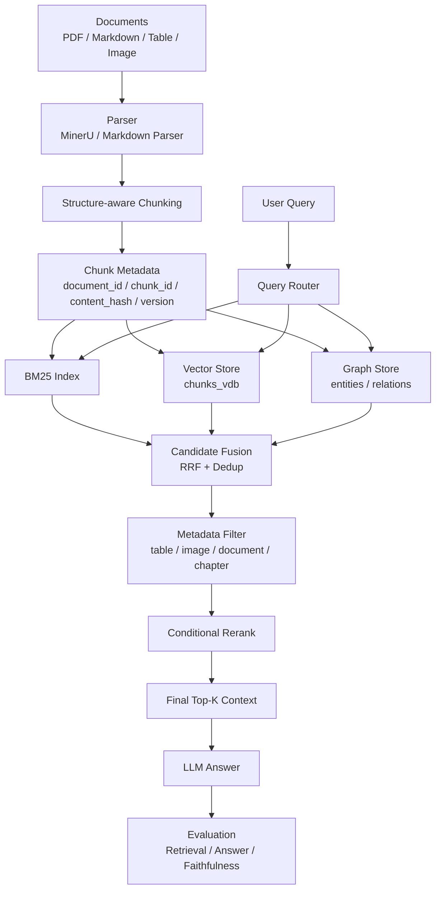

# Multimodal GraphRAG QA System for Complex Industry Documents

基于 [HKUDS/LightRAG](https://github.com/HKUDS/LightRAG) 的二次开发项目，面向复杂行业文档中的精确检索、语义问答、实体关系推理、表格/图片问答和文档增量更新。

本项目在复现 LightRAG 原始流程的基础上，围绕工程化 RAG 系统补充了结构感知切片、BM25 + Vector 混合检索、RRF 候选融合、Query Router、条件 Rerank、Metadata Filter、增量索引和多指标评测体系。

> 当前文件是最终 README 候选版本。确认后可替换仓库根目录 `README.md`。

## Highlights

| Module | What I Built | Result |
| --- | --- | --- |
| Structure-aware Chunking | 基于标题、段落、表格、图片描述组织 chunk，并保留 metadata | `heading_coverage` 0 -> 1，tiny chunks 2 -> 0 |
| Hybrid Retrieval | 对比 BM25、Vector、Graph 与 RRF 融合 | BM25 + Vector + RRF 是当前最稳默认主干 |
| Query Router | 根据问题类型选择 BM25 / Vector / Graph / Rerank / Filter | `router_safe` Recall@5 = 0.9875 |
| Conditional Rerank | 只在候选池已召回但排序不佳时启用 | 避免全局 rerank 伤害简单问题 |
| Incremental Index | 使用 `document_id`、`chunk_id`、`content_hash`、`version` 检测更新 | embedding 重算 34 -> 2，节省 94.12% |
| Metadata Filter | 表格、图片、多跳问题按 `content_type` 过滤候选 | 多模态子集 Context Precision 0.25 -> 1.0 |

## Architecture



## Motivation

复杂行业文档不同于普通纯文本知识库：

- 文档中混合章节、条款、表格、图片、编号、专业术语和跨页内容。
- 查询既可能是精确编号，也可能是语义解释、实体关系、全局总结或跨文档问题。
- 固定长度切片容易割裂语义结构，影响上下文完整性。
- 单一路检索无法同时兼顾精确词匹配、语义召回和实体关系。
- Graph 检索有助于实体关系问题，但直接全量融合可能引入噪声。
- 文档频繁更新时，全量重建向量索引成本较高。

本项目的最终策略不是“所有模块全部打开”，而是：

```text
BM25 + Vector + RRF 作为默认主干；
Query Router 判断是否启用 Graph、Rerank、Metadata Filter；
结构感知切片和增量索引作为底层工程能力；
用真实实验指标验证每个模块是否值得保留。
```

## Relation To LightRAG

原版 LightRAG 提供了 GraphRAG 的核心能力：

- 文档入库：`insert()` / `ainsert()`
- 文档切片和 chunk 存储：`text_chunks`
- chunk 向量索引：`chunks_vdb`
- 实体向量索引：`entities_vdb`
- 关系向量索引：`relationships_vdb`
- 图存储：Graph Store
- 查询模式：`naive`、`local`、`global`、`hybrid`、`mix`

本项目的二次开发重点：

- 设计结构感知 chunk schema。
- 对比 BM25、Vector、Graph 单路检索。
- 实现 BM25 + Vector + RRF 混合检索实验。
- 设计规则版 Query Router。
- 验证条件 Rerank 的收益和副作用。
- 设计 Metadata Filter 支持表格和图片问题。
- 设计并实验增量索引策略。
- 构建正式评测集和多指标评测脚本。

## Retrieval Strategy

| Question Type | Strategy | Graph | Rerank | Metadata Filter |
| --- | --- | --- | --- | --- |
| fact | BM25 or BM25 + Vector | No | No | Usually no |
| numeric / code | BM25 | No | No | Table questions only |
| semantic | Vector or BM25 + Vector | No | Usually no | Usually no |
| entity relation | BM25 + Vector, optional Graph | Conditional | Conditional | Usually no |
| cross paragraph | BM25 + Vector + RRF | Usually no | Usually no | Usually no |
| cross document | BM25 + Vector + RRF, optional Graph | Conditional | Conditional | Optional |
| global summary | Larger candidate pool + summary-aware rerank | Conditional | Yes | Optional |
| table | `content_type=table` + BM25 / Vector | No | Usually no | Yes |
| image | `content_type=image` + caption / OCR / VLM description | No | Usually no | Yes |
| multi-hop | Metadata Filter + BM25 + Vector + RRF | Conditional | Conditional | Yes |

## Experiments

### Retrieval

| Method | Recall@5 | MRR | Context Precision | Comment |
| --- | ---: | ---: | ---: | --- |
| BM25 | 0.9375 | 1.0000 | 0.2400 | Strong on exact terms and numeric queries |
| Vector | 0.9625 | 0.9000 | 0.2500 | Strong semantic recall |
| Graph | 0.7125 | 0.7000 | 0.1900 | Not suitable as default route on current dataset |
| BM25 + Vector + RRF | 0.9625 | 1.0000 | 0.2500 | Stable default hybrid retrieval |
| Router Safe | 0.9875 | 1.0000 | 0.2567 | Recommended retrieval policy |

### Answer Quality

| Method | Answer Coverage | Answer Pass Rate | Faithfulness Proxy | Answer Relevance Proxy |
| --- | ---: | ---: | ---: | ---: |
| BM25 | 0.6283 | 0.45 | 0.8075 | 0.8100 |
| Vector | 0.6975 | 0.55 | 0.9425 | 0.8267 |
| Router | 0.7033 | 0.60 | 0.8633 | 0.8350 |

### Ablation Takeaways

| Module | Finding | Decision |
| --- | --- | --- |
| Structure-aware Chunking | Improves structure metadata, but does not universally improve Recall on the small dataset | Keep as document foundation |
| BM25 | Very strong for exact terms, IDs and numeric values | Keep by default |
| Vector Retrieval | Stable semantic recall | Keep by default |
| Graph Retrieval | Direct graph fusion may introduce noise | Enable conditionally |
| RRF | Combines BM25 and Vector ranking advantages | Keep by default |
| Rerank | Helps some hard cases, but can hurt simple questions | Enable conditionally |
| Query Router | Prevents overusing expensive or noisy modules | Keep by default |
| Metadata Filter | Reduces noise for table/image questions | Enable for multimodal queries |
| Incremental Index | Reduces embedding recomputation significantly | Keep by default |

## Dataset And Metrics

Evaluation dataset:

```text
experiments/evaluation/datasets/eval_v0_20.jsonl
```

Question types:

```text
fact, numeric, entity_relation, cross_paragraph, cross_document,
causal_reasoning, global_summary, table, image, multi_hop
```

Metrics:

| Metric | Meaning |
| --- | --- |
| Recall@K | How many gold evidence chunks are retrieved in Top-K |
| Hit@K | Whether Top-K contains at least one gold evidence chunk |
| MRR | Whether the first correct evidence appears early |
| Context Precision | How much of the retrieved context is useful evidence |
| Answer Coverage | How many expected answer points are covered |
| Answer Pass Rate | Whether the generated answer passes the rule-based check |
| Faithfulness Proxy | Whether answer claims are supported by retrieved context |
| Answer Relevance Proxy | Whether the answer directly addresses the question |
| Latency | Retrieval or generation cost |

> Current Faithfulness and Answer Relevance are lightweight proxy metrics. They are not a replacement for full RAGAS, stronger LLM-as-judge evaluation, or human review.

## Quick Start

### 1. Clone

```bash
git clone https://github.com/HKUDS/LightRAG.git
cd LightRAG
```

### 2. Create Environment

Windows PowerShell:

```powershell
python -m venv .venv
.\.venv\Scripts\activate
python -m pip install -U pip
pip install -e .
```

Linux / macOS:

```bash
python -m venv .venv
source .venv/bin/activate
python -m pip install -U pip
pip install -e .
```

### 3. Prepare Local Models

This project uses Ollama for local reproduction:

```bash
ollama pull qwen2.5:3b
ollama pull nomic-embed-text
ollama list
```

Start Ollama if it is not running:

```bash
ollama serve
```

### 4. Run Experiments

Retrieval evaluation:

```bash
python experiments/evaluation/scripts/run_retrieval_eval_v0.py
```

Answer evaluation:

```bash
python experiments/evaluation/scripts/run_answer_eval_v0.py
```

Hybrid retrieval:

```bash
python experiments/evaluation/scripts/run_hybrid_retrieval_v0.py
```

Query Router ablation:

```bash
python experiments/evaluation/scripts/run_query_router_ablation_v0.py
```

Incremental index ablation:

```bash
python experiments/evaluation/scripts/run_incremental_index_ablation_v0.py
```

Merge final experiment table:

```bash
python experiments/evaluation/scripts/merge_stage8_final_table_v0.py
```

Expected outputs:

```text
experiments/evaluation/results/
experiments/evaluation/*_REPORT.md
```

## Example

Sample question from the evaluation set:

```text
Question:
What is BluePump-X100?

Gold Answer:
BluePump-X100 is a high-pressure pump in the refinery cooling system
that moves cooling water through Pipeline-7A.

Expected Evidence:
doc_001_equipment-chunk-000
```

Pipeline:

```text
question
-> retrieve candidate chunks
-> fuse candidates with RRF
-> apply router/filter/rerank when needed
-> build final Top-K context
-> generate answer
-> evaluate retrieval and answer quality
```

## Repository Structure

```text
LightRAG/
├── lightrag/
│   ├── lightrag.py                    # insert / query entry points
│   ├── operate.py                     # naive_query / kg_query workflows
│   ├── base.py                        # QueryParam, storage interfaces, status models
│   └── kg/                            # vector, KV and graph storage implementations
│
├── experiments/
│   └── evaluation/
│       ├── datasets/
│       │   └── eval_v0_20.jsonl
│       ├── scripts/
│       │   ├── run_retrieval_eval_v0.py
│       │   ├── run_answer_eval_v0.py
│       │   ├── run_hybrid_retrieval_v0.py
│       │   ├── run_rerank_ablation_v0.py
│       │   ├── run_query_router_ablation_v0.py
│       │   ├── run_metadata_filter_ablation_v0.py
│       │   ├── run_incremental_index_ablation_v0.py
│       │   └── merge_stage8_final_table_v0.py
│       ├── results/
│       └── *_REPORT.md
│
└── README_FINAL.md
```

## Code Entry Points

| Topic | File |
| --- | --- |
| LightRAG query parameters | `lightrag/base.py` |
| Insert and query entry points | `lightrag/lightrag.py` |
| naive / kg query workflows | `lightrag/operate.py` |
| Retrieval evaluation | `experiments/evaluation/scripts/run_retrieval_eval_v0.py` |
| Answer evaluation | `experiments/evaluation/scripts/run_answer_eval_v0.py` |
| Chunking ablation | `experiments/evaluation/scripts/run_chunking_ablation_v0.py` |
| Hybrid retrieval | `experiments/evaluation/scripts/run_hybrid_retrieval_v0.py` |
| Rerank ablation | `experiments/evaluation/scripts/run_rerank_ablation_v0.py` |
| Query Router ablation | `experiments/evaluation/scripts/run_query_router_ablation_v0.py` |
| Metadata Filter ablation | `experiments/evaluation/scripts/run_metadata_filter_ablation_v0.py` |
| Incremental index ablation | `experiments/evaluation/scripts/run_incremental_index_ablation_v0.py` |

## Reports

| Report | Content |
| --- | --- |
| `EXPERIMENT_PLAN_V1.md` | Experiment design |
| `CHUNKING_ABLATION_V0_REPORT.md` | Fixed vs structure-aware chunking |
| `SINGLE_ROUTE_RETRIEVAL_V0_REPORT.md` | BM25 / Vector / Graph comparison |
| `HYBRID_RETRIEVAL_V0_REPORT.md` | Hybrid retrieval comparison |
| `RERANK_ABLATION_V0_REPORT.md` | Rerank ablation |
| `QUERY_ROUTER_ABLATION_V0_REPORT.md` | Query Router ablation |
| `INCREMENTAL_INDEX_ABLATION_V0_REPORT.md` | Incremental index ablation |
| `METADATA_FILTER_ABLATION_V0_REPORT.md` | Metadata Filter ablation |
| `STAGE8_FINAL_OPTIMIZED_EXPERIMENT_TABLE_V0.md` | Final optimized experiment table |

## Limitations

- The current evaluation set contains 20 questions, so results are small-scale validation rather than large benchmark conclusions.
- Table and image chunks are simulated multimodal chunks. Full PDF + MinerU integration is planned.
- Rerank is implemented as a lightweight local experiment, not a production cross-encoder reranker.
- Faithfulness and Answer Relevance are proxy metrics and should be replaced or supplemented by stronger LLM judge / RAGAS evaluation.
- Graph retrieval introduces noise on the current dataset, so entity extraction, graph filtering and fusion strategy need more work.

## Roadmap

- Integrate MinerU for real PDF parsing.
- Support OCR, image caption and VLM-generated descriptions.
- Connect structure-aware chunks to the LightRAG insertion pipeline.
- Implement production-ready `BM25Retriever` and `CandidateMerger`.
- Add a real rerank model.
- Expand the evaluation set to 100-300 questions.
- Add real industry PDFs, tables, diagrams and cross-document QA cases.
- Build a Web demo and knowledge graph visualization.

## Resume Description

基于 HKUDS/LightRAG 二次开发复杂行业文档知识库问答系统，系统梳理并复现 GraphRAG 从文档入库、chunk embedding、实体关系抽取、图谱构建到多模式查询的完整链路。在原始 Vector / Graph 检索基础上，设计结构感知切片、BM25 + Vector + RRF 混合检索、规则版 Query Router、条件 Rerank、Metadata Filter 和增量索引机制，并构建覆盖事实、数值、实体关系、跨文档、表格和图片问题的小型评测集。实验结果显示，BM25 + Vector + RRF 相比 BM25 将 Recall@5 从 0.9375 提升到 0.9625，Query Router 进一步提升到 0.9875；增量索引将 embedding 重算量从 34 次降低到 2 次，节省 94.12%；多模态 Metadata Filter 将表格/图片问题 Context Precision 从 0.25 提升到 1.0。

## Acknowledgements

This project is based on HKUDS LightRAG:

- GitHub: https://github.com/HKUDS/LightRAG
- Paper: https://arxiv.org/abs/2410.05779

The secondary development, experiments and reports in this repository are for learning and engineering practice.
