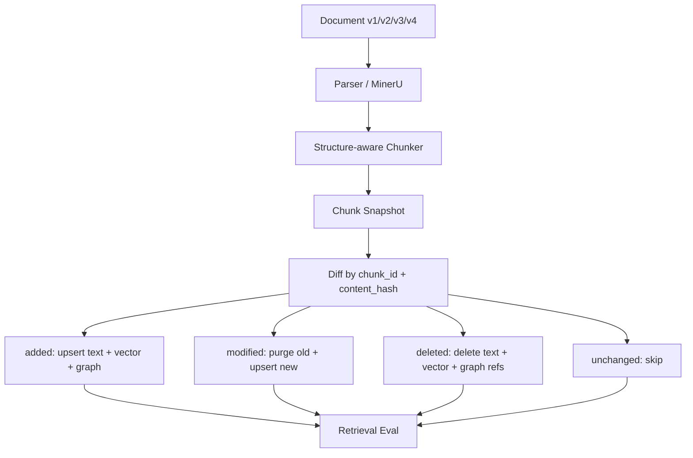

# 阶段 8.7：增量索引消融实验设计

## 1. 本阶段要学什么

本阶段学习 Incremental Indexing（增量索引）。

前面阶段主要关心“检索得准不准”，这一阶段关心“文档更新后，系统能不能只处理变化的部分”。

在真实行业知识库里，文档经常会更新：

1. 设备手册新增一节。
2. 安全规则修改一个阈值。
3. 巡检报告删除一段旧说明。
4. 图片 OCR 或表格解析结果发生变化。

如果每次都整库重新入库，成本会很高：

```text
重新解析所有文档
重新切所有 chunk
重新生成所有 embedding
重新抽取所有 entity/relation
重新写 vector store 和 graph store
```

增量索引要做的是：

```text
只处理新增、修改、删除的 chunk
不变的 chunk 不重新 embedding
不变的 entity/relation 不重复抽取
```

## 2. 关键概念

| 字段 | 中文含义 | 作用 |
| --- | --- | --- |
| `document_id` | 文档 ID | 标识一篇文档，例如 `doc_003_incident_report` |
| `chunk_id` | 切片 ID | 标识文档中的一个 chunk，例如 `doc_003_incident_report-chunk-001` |
| `content_hash` | 内容哈希 | 对 chunk 内容做 hash，用来判断内容有没有变化 |
| `version` | 文档/切片版本 | 标记这次更新属于第几个版本 |
| `action` | 更新动作 | `added` / `modified` / `deleted` / `unchanged` |
| `affected_stores` | 受影响存储 | 这次动作需要同步更新哪些存储 |

一句话理解：

`chunk_id` 负责“找同一个位置”，`content_hash` 负责“判断内容变没变”，`version` 负责“记录这是第几次变化”。

## 3. 为什么不能只看 chunk_id

假设有一个旧 chunk：

```text
chunk_id = doc_002_safety_rules-chunk-001
content = Pipeline-7A alarm threshold is 9.5 MPa.
content_hash = aaa
```

文档更新后：

```text
chunk_id = doc_002_safety_rules-chunk-001
content = Pipeline-7A alarm threshold is 9.2 MPa.
content_hash = bbb
```

`chunk_id` 没变，但内容变了。

如果只看 `chunk_id`，系统会误以为这个 chunk 不需要更新，结果向量库和图谱里还保留旧的 9.5 MPa。

所以必须看 `content_hash`。

## 4. 为什么不能只看 content_hash

如果只看 `content_hash`，两个不同文档里刚好有同一句话，会被误认为是同一个 chunk。

例如：

```text
doc_001_equipment-chunk-002: ReliefValve-RV9 must be inspected.
doc_002_safety_rules-chunk-000: ReliefValve-RV9 must be inspected.
```

它们内容可能一样，但来源不同，metadata（元数据）、章节、页码、文档归属都不同。

所以不能只看 hash，也要保留 `document_id` 和 `chunk_id`。

## 5. LightRAG 源码中的相关基础

LightRAG 原版已经有一些增量索引需要的基础设施。

### 5.1 文档状态

源码位置：

`lightrag/base.py`

`DocStatus`（文档状态）定义了：

```text
PENDING -> PARSING -> ANALYZING -> PROCESSING -> PROCESSED / FAILED
```

这说明 LightRAG 已经不是简单“一把梭入库”，而是有状态机。

`DocProcessingStatus`（文档处理状态）里已经包含：

```text
chunks_count
chunks_list
metadata
content_hash
```

其中 `chunks_list` 可以用于删除文档时找到它拥有的 chunk，`content_hash` 可以用于整篇文档级别的去重。

参考源码：

`lightrag/base.py:941`

`lightrag/base.py:956`

`lightrag/base.py:980`

`lightrag/base.py:989`

### 5.2 content_hash 查询

源码位置：

`lightrag/base.py:1287`

LightRAG 的 `DocStatusStorage`（文档状态存储）里有：

```python
get_doc_by_content_hash(content_hash)
```

它用于整篇文档级别的内容去重。

但我们二次开发要做的是更细粒度的 chunk 级别增量更新：

```text
document-level hash: 判断整篇文档是否重复
chunk-level hash: 判断某个 chunk 是否变化
```

所以不能只依赖原版 document `content_hash`，还要在 chunk metadata 里保存 chunk `content_hash`。

### 5.3 删除链路

源码位置：

`lightrag/lightrag.py:5605`

`adelete_by_doc_id()` 会删除文档及其相关数据，包括：

```text
full_docs
doc_status
text_chunks
chunks_vdb
graph_store
entities_vdb
relationships_vdb
```

源码里还可以看到删除 chunk 时会调用：

```python
self.chunks_vdb.delete(chunk_ids)
self.text_chunks.delete(chunk_ids)
```

参考源码：

`lightrag/lightrag.py:5104`

`lightrag/lightrag.py:5105`

这说明 LightRAG 已经具备删除某些 chunk 的底层能力，只是原版主要按 document 维度组织删除。我们的二次开发要把它扩展成“按 changed chunk 更新”。

## 6. 现在已有的阶段 6 小实验

已有脚本：

`experiments/baseline_industry_mini/run_incremental_index_experiment.py`

它做了一个模拟 diff（差异计算）：

```text
旧版本：11 个 chunk
新版本：11 个 chunk
unchanged: 9
added: 1
modified: 1
deleted: 1
re_embedding_needed: 2
graph_cleanup_needed: 2
```

这说明：

如果整库重建，需要对 11 个新 chunk 做 embedding。

如果增量索引，只需要对：

```text
新增 chunk 1 个
修改 chunk 1 个
```

做 embedding。

节省比例：

```text
1 - 2 / 11 = 81.8%
```

这个实验还只是模拟 diff，不是真正更新 LightRAG 工作目录。阶段 8.7 要把它设计成正式消融实验。

## 7. 正式消融实验要对比什么

### 7.1 Full Re-index（整库重建）

流程：

```text
旧文档集合
-> 删除旧工作目录
-> 对新文档集合重新 insert
-> 重新 chunk
-> 重新 embedding
-> 重新抽 entity/relation
-> 重新构建 graph/vector index
```

优点：

1. 实现简单。
2. 不容易产生脏数据。

缺点：

1. 速度慢。
2. embedding 成本高。
3. 文档越多越浪费。
4. 大规模知识库无法频繁更新。

### 7.2 Incremental Index（增量索引）

流程：

```text
旧 snapshot
新文档解析结果
-> 新 chunk snapshot
-> 比较 chunk_id + content_hash
-> unchanged: 跳过
-> added: 写入 text_chunks + chunks_vdb + graph/entity/relation
-> modified: 删除旧贡献，再写入新贡献
-> deleted: 删除 text_chunks + chunks_vdb + graph/entity/relation
```

优点：

1. 不变 chunk 不重新 embedding。
2. 只处理变化内容。
3. 成本和更新时间随“变化量”增长，而不是随“全库大小”增长。

缺点：

1. 实现更复杂。
2. 需要维护 chunk_id 稳定性。
3. 需要保证 vector store 和 graph store 一致。
4. 删除/修改时要处理实体和关系的归属问题。

## 8. 消融实验矩阵

| 编号 | 实验方案 | 说明 |
| --- | --- | --- |
| INC-E0 | full_reindex | 每次更新后整库重建 |
| INC-E1 | incremental_text_vector_only | 只对 text_chunks 和 chunks_vdb 做增量 |
| INC-E2 | incremental_with_graph_cleanup | 对 text/vector/graph/entity/relation 同步增量 |
| INC-E3 | incremental_without_delete | 故意不删除旧 chunk，观察脏数据 |
| INC-E4 | incremental_without_hash | 只看 chunk_id，不看 content_hash |
| INC-E5 | unstable_chunk_id | chunk_id 每次重算，观察误判为全量变化 |

## 9. 每组实验要记录的指标

| 指标 | 中文含义 | 为什么重要 |
| --- | --- | --- |
| `old_chunk_count` | 旧 chunk 数 | 更新前规模 |
| `new_chunk_count` | 新 chunk 数 | 更新后规模 |
| `unchanged_count` | 不变 chunk 数 | 增量索引跳过的数量 |
| `added_count` | 新增 chunk 数 | 需要新增索引 |
| `modified_count` | 修改 chunk 数 | 需要重算 embedding 和重抽图谱 |
| `deleted_count` | 删除 chunk 数 | 需要删除旧索引 |
| `embedding_recompute_count` | 需要重算 embedding 的 chunk 数 | 直接对应 embedding 成本 |
| `embedding_saved_ratio` | embedding 节省比例 | 衡量增量索引价值 |
| `graph_cleanup_count` | 需要清理图谱贡献的 chunk 数 | 衡量图谱一致性成本 |
| `stale_chunk_count` | 残留旧 chunk 数 | 衡量脏数据 |
| `stale_entity_count` | 残留旧实体数 | 检查 Graph Store 一致性 |
| `stale_relation_count` | 残留旧关系数 | 检查 Graph Store 一致性 |
| `index_update_latency_ms` | 索引更新时间 | 工程性能 |
| `retrieval_regression_count` | 更新后检索退化数量 | 验证更新没有破坏问答 |

## 10. 更新动作和对应存储

| Action | 判断条件 | text_chunks | chunks_vdb | graph_store | entities_vdb | relationships_vdb | doc_status |
| --- | --- | --- | --- | --- | --- | --- | --- |
| `unchanged` | chunk_id 相同且 content_hash 相同 | 不动 | 不动 | 不动 | 不动 | 不动 | 可更新版本摘要 |
| `added` | 新 snapshot 有，旧 snapshot 没有 | 新增 | 新增 embedding | 抽取并合并 | 新增/合并 | 新增/合并 | 更新 chunks_list |
| `modified` | chunk_id 相同但 content_hash 不同 | 更新 | 重新 embedding | 删除旧贡献再写新贡献 | 重建相关实体 | 重建相关关系 | version +1 |
| `deleted` | 旧 snapshot 有，新 snapshot 没有 | 删除 | 删除向量 | 删除或重建受影响贡献 | 删除/降权/重建 | 删除/降权/重建 | 更新 chunks_list |

## 11. 为什么 Graph Store 最麻烦

向量库里的 chunk 通常是一对一：

```text
chunk_id -> embedding
```

删除一个 chunk，可以直接：

```text
chunks_vdb.delete(chunk_id)
text_chunks.delete(chunk_id)
```

但图谱不是一对一。

一个实体可能来自多个 chunk：

```text
BluePump-X100
<- doc_001_equipment-chunk-000
<- doc_002_safety_rules-chunk-000
<- doc_003_incident_report-chunk-000
```

如果删除其中一个 chunk，不能直接删除 `BluePump-X100` 这个实体，因为其他 chunk 还在引用它。

所以 Graph 增量更新必须考虑 attribution（归属）：

```text
某个 entity/relation 是哪些 chunk 贡献的？
删除一个 chunk 后，还有没有其他 chunk 支撑它？
如果还有，保留并重算描述/权重
如果没有，才删除
```

这也是为什么 LightRAG 的删除逻辑里有完整的 KG purge（知识图谱清理）和 rebuild（重建）机制。

## 12. 正式实验数据设计

基于现有 `baseline_industry_mini`，构造四个版本：

### v1 初始版本

包含当前 3 个文本文档 + 1 个多模态文档。

### v2 小修改版本

修改一个数值：

```text
Pipeline-7A alarm threshold: 9.5 MPa -> 9.2 MPa
```

验证：

1. 相关 chunk 是否被识别为 `modified`。
2. 旧答案是否不再出现 9.5 MPa。
3. 新查询是否能回答 9.2 MPa。

### v3 新增章节版本

新增一个章节：

```text
Follow-up Verification
After maintenance, the team scheduled a follow-up inspection within 30 days.
```

验证：

1. 新 chunk 是否被识别为 `added`。
2. 是否只对新增 chunk embedding。
3. 新问题是否能检索到新增证据。

### v4 删除章节版本

删除一个旧章节：

```text
Control System
```

验证：

1. 删除 chunk 是否从 `text_chunks` 消失。
2. 删除 chunk 是否从 `chunks_vdb` 消失。
3. 相关实体/关系是否被正确清理或重建。
4. 查询旧内容时是否不会命中已删除证据。

## 13. 需要新增的评测问题

当前 `eval_v0_20` 主要测检索效果，不够专门测更新。

阶段 8.7 后续执行时应新增一个更新评测集：

`experiments/evaluation/datasets/incremental_eval_v0.jsonl`

示例问题：

| sample_id | 版本 | 问题 | 期望 |
| --- | --- | --- | --- |
| INC-Q001 | v1 | What is the alarm threshold for Pipeline-7A? | 9.5 MPa |
| INC-Q002 | v2 | What is the alarm threshold for Pipeline-7A? | 9.2 MPa |
| INC-Q003 | v2 | Is 9.5 MPa still the alarm threshold? | No |
| INC-Q004 | v3 | When is the follow-up inspection scheduled? | within 30 days |
| INC-Q005 | v4 | Which system receives reports from Sensor T-200 and Sensor P-210? | 应无法从已删除章节回答，或标记缺证据 |

## 14. 实验输出文件设计

计划新增脚本：

`experiments/evaluation/scripts/run_incremental_index_ablation_v0.py`

输出目录：

`experiments/evaluation/results/incremental_index_ablation_v0/`

输出文件：

| 文件 | 内容 |
| --- | --- |
| `incremental_index_ablation_v0_summary.csv` | 每种方案的总体指标 |
| `incremental_index_ablation_v0_actions.csv` | 每个 chunk 的 added/modified/deleted/unchanged |
| `incremental_index_ablation_v0_store_check.csv` | text/vector/graph 是否一致 |
| `incremental_index_ablation_v0_query_check.csv` | 更新前后查询是否符合新版本 |
| `incremental_index_ablation_v0_records.jsonl` | 完整明细 |

## 15. 预期结果

假设 v1 有 11 个 chunk，v2/v3/v4 总共只变化 2-4 个 chunk。

Full Re-index：

```text
embedding_recompute_count = 全部新 chunk 数
```

Incremental Index：

```text
embedding_recompute_count = added_count + modified_count
```

预期：

```text
增量索引 embedding_saved_ratio > 70%
```

同时必须满足：

```text
stale_chunk_count = 0
stale_relation_count = 0
更新后查询答案符合新版本
```

否则虽然省成本，但数据不一致，不能算成功。

## 16. 最容易出错的地方

### 16.1 chunk_id 不稳定

如果 chunk_id 只是按顺序生成：

```text
chunk-000
chunk-001
chunk-002
```

那么在文档中间新增一段后，后面所有 chunk 编号都可能变化。

系统会误以为大量 chunk 都被修改。

更稳的设计：

```text
chunk_id = document_id + section_path + local_order + section_hash
```

或者至少保留：

```text
document_id
chunk_order_index
chapter
section
content_hash
```

用于辅助匹配。

### 16.2 修改 chunk 时只更新向量，不更新图谱

这样会导致：

```text
Vector Store 是新内容
Graph Store 还是旧实体/关系
```

用户走 graph/mix 查询时可能拿到旧答案。

### 16.3 删除 chunk 时没有清理实体/关系归属

如果删了原文 chunk，但实体关系还在，系统会出现“图谱知道一个关系，但找不到可靠原文证据”的问题。

这会降低 Faithfulness（忠实性）。

### 16.4 content_hash 没有做 normalize

如果只是多了一个空格、换行、页眉页脚变化，就误判为修改，会浪费 embedding。

所以 hash 前应该做 normalize：

```text
去掉行尾空格
统一换行
可选：去掉页眉页脚
可选：表格按结构化 JSON 排序后再 hash
```

## 17. 和前面模块的关系



增量索引不是单独模块，它依赖：

1. 结构感知切片：保证 chunk 边界稳定。
2. metadata：保证 chunk 可追踪。
3. embedding：只重算变化 chunk。
4. vector store：支持 upsert/delete。
5. graph store：支持按 chunk 归属清理实体关系。
6. doc_status：记录文档版本、状态和 chunks_list。

## 18. 下一步执行计划

阶段 8.8 建议执行：

```text
实现 run_incremental_index_ablation_v0.py
-> 构造 v1/v2/v3/v4 snapshots
-> 计算 full_reindex vs incremental 的成本差异
-> 检查 text/vector/graph 一致性
-> 跑更新前后查询验证
-> 输出正式结果表
```

注意：阶段 8.7 只是设计，不编造结果。正式指标必须等阶段 8.8 真实运行后再填写。

